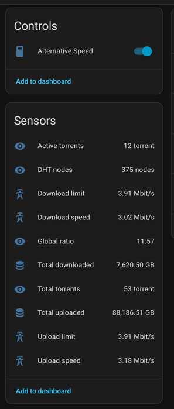

# qbit2mqtt

**qbit2mqtt** is a utility service that provides statistics from qBitTorrent instance 
to Home Assistant over MQTT. It developed as a replacement for HA integration that sometimes does not work
and requires HA network / credentials access to torrent client.

**qbit2mqtt** automatically discover its entities into HA via [MQTT discovery](https://www.home-assistant.io/integrations/mqtt/#configuration-via-mqtt-discovery).

 

**qbit2mqtt** allows HA to control alternative speed setting and (maybe) will support more active features.


## Running

Simply run script on host or using docker
```shell
python3 qbit2mqtt/__init__.py
# or using docker
docker compose up -d 
```

You need to provide information about qBitTorrent instance and MQTT broker 
via environment variables (see [sample.env](sample.env))

Generic parameters are:
- `QBIT2MQTT_NAME` - name of qBitTorrent instance for HA
- `QBIT2MQTT_INTERVAL` - monitor interval in seconds. 5 seconds by default
- `QBIT2MQTT_DISCOVERY_INTERVAL` - discovery interval in seconds. 30 by default

qBitTorrent instance parameters are:
- `QBIT2MQTT_QBIT_URL` - url of qBitTorrent instance with scheme. `http://localhost:8080/` by default
- `QBIT2MQTT_QBIT_USER` - username for qBitTorrent. `admin` by default
- `QBIT2MQTT_QBIT_PASSWORD` - password for qBitTorrent. `admin` by default

MQTT broker parameters are:
- `QBIT2MQTT_MQTT_HOST` - broker hostname. `localhost` by default
- `QBIT2MQTT_MQTT_USER` - broker authentication username. Empty by default. Leave empty to disable authentication
- `QBIT2MQTT_MQTT_PASSWORD` - broker authentication password. Only used when `QBIT2MQTT_MQTT_USER` is not empty
